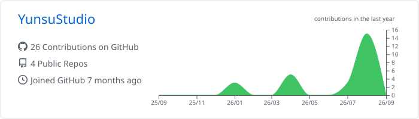
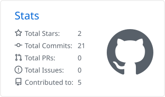
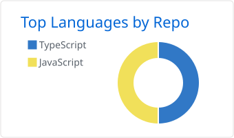

<div align="center">


[](https://git.io/typing-svg)

<p>
  <a href="https://github.com/YunsuStudio?tab=followers"></a>
  <a href="https://github.com/YunsuStudio?tab=repositories"></a>
  
</p>

</div>

## About Me

```text
Name      YunSu.云溯
Focus     Web Development / Android Development / Reverse Engineering / Embedded Development / Crack（end）
Status    Learning, building, and shipping
Goal      Make technology simple, practical, and delightful
```

你好，我是 **云溯**，理想与现实结合，知行合一的一位萌新开发者。

- 正在专注于现代产品开发与实用工具
- 持续学习新的技术，并用项目验证想法
- 关注代码质量、产品体验和长期可维护性
- 欢迎交流有趣的创意与开源项目

## Tech Stack

<div align="center">

[](https://skillicons.dev)

</div>

## GitHub Activity

<div align="center">







</div>

## Contribution Journey

<div align="center">
  


</div>

## Connect

<div align="center">

[](https://github.com/YunsuStudio)

<sub>Keep learning. Keep building. Keep shipping.</sub>


</div>
